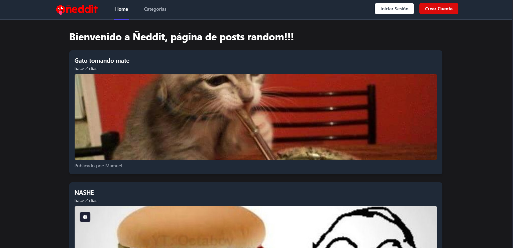
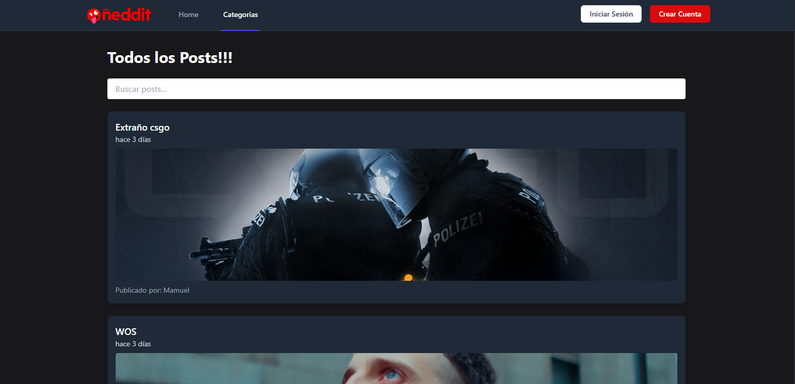
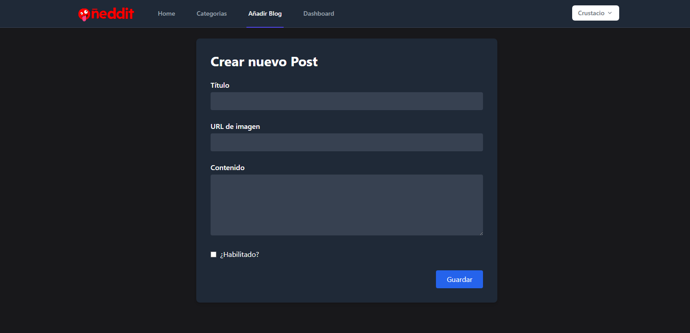
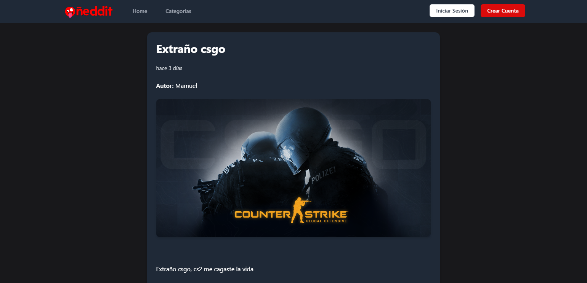
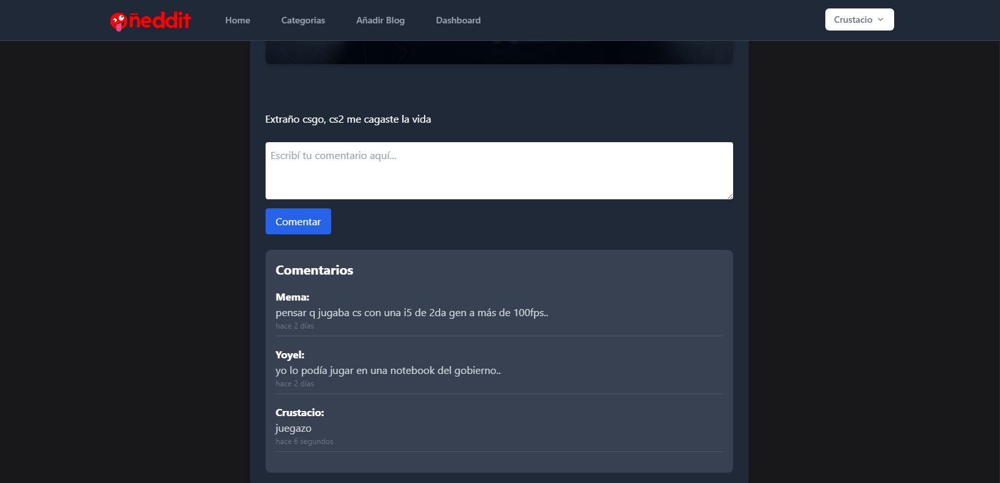
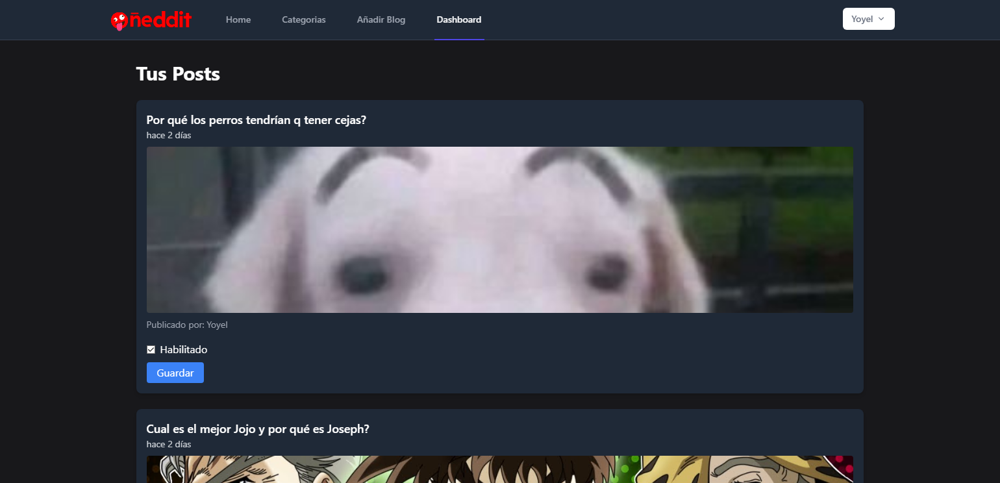
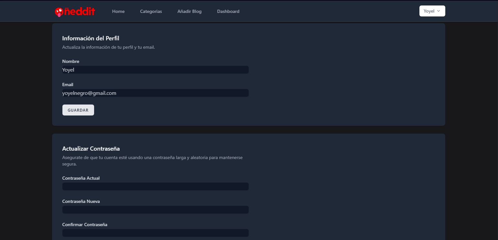

<p align="center"><a href="https://laravel.com" target="_blank"></a></p>

# My Blog 📝

<hr>

```php
$alumno = [
  'nombre'=> 'Emanuel Pinedo',
  'legajo'=> 'FAI-4871',
]
```

<hr>

# Ñeddit, Blog con Laravel, XAMPP y Tailwind

Este es un proyecto de blog un desarrollado con **Laravel**, utilizando **XAMPP (Apache y MySQL) como ejecución. Permite a los usuarios autenticados crear, editar, eliminar y ver publicaciones, así como agregar comentarios.

<hr>

## Tecnologías Utilizadas
- ✅**Laravel 12** → Framework PHP para estructurar el proyecto en MVC
- ✅**XAMPP (Apache y MySQL)** → Servidor local y base de datos
- ✅**Blade** → Motor de plantillas de laravel
- ✅**Laravel Breeze** → Sistema de autenticación
- ✅**Tailwind CSS** → Para estilos
- ✅**Validación de formularios** → con `@csrf`, validaciones en el backend y mensajes de error
- ✅**Control de acceso** → para que solo usuarios autenticados puedan crear/editar/comentar

<hr>

## ⚙️ Instalación

### 1️⃣ Clonar el repositorio:
```bash
    git clone https://github.com/emanuelPinedo/myblog.git
    cd myblog
 ```

### 2️⃣ Instalar dependencias:
```bash
    composer install
    npm install 
```

### 3️⃣ Configurar archivo .env
```.env
    DB_CONNECTION=mysql
    DB_HOST=127.0.0.1
    DB_PORT=3306
    DB_DATABASE=nombre_base_datos
    DB_USERNAME=root
    DB_PASSWORD=
```

### 4️⃣ Instalar y configurar Laravel Breeze
```bash
    composer require laravel/breeze --dev
    php artisan breeze:install
    npm run dev
    php artisan migrate
```
### 5️⃣ Correr servidor
```bash
    php artisan serve
```


## 📝 Funcionalidades
- 🔹 Registro e inicio de sesión
- 🔹 Crear, ver, editar y eliminar posts
- 🔹 Agregar comentarios a los posts
- 🔹 Ver imagen del post
- 🔹 Vista y edición de publicaciones propias
- 🔹 Diseño responsive con Tailwind CSS

## 📸 Imagenes del Proyecto

### 🔹 **Home**

> 

### 🔹 **Posts**

> 

### 🔹 **Creación de un Post**

> 

### 🔹 **Vista de un Post**

> 

### 🔹 **Comentarios en un Post**

> 

### 🔹 **Posts de un Usuario**

> 

### 🔹 **Edición de Perfil**

> 